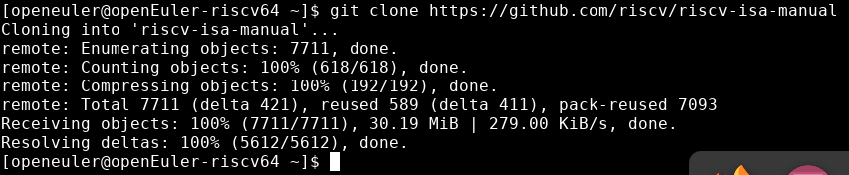
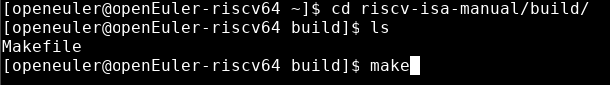
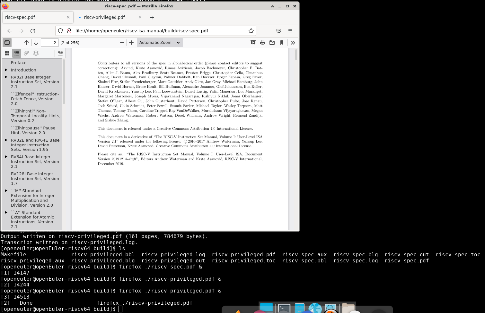

# riscv-isa-manual构建

## 操作步骤

### 第1步：准备好OpenEuler RISC-V虚拟环境

- 本人使用的是OpenEuler 22.03 V1 RISC-V

### 第2步：克隆仓库

```bash
git clone https://github.com/riscv-isa-manual.git
```



### 第3步：安装texlive环境

```bash
sudo dnf install texlive{,-multirow,-comment,-verbatimbox} -y
```

### 第4步：一个make，解决一切问题

```bash
cd ./riscv-isa-manual/build/
make
```



Okay，执行完了之后，ls一下，出现了构建好的pdf文件，使用Firefox打开吧！



## 构建脚本

[戳这里](./build_script.sh)

- 每日早晨八点，准时构建