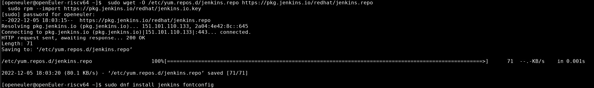
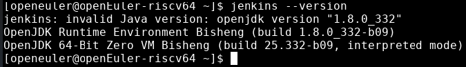
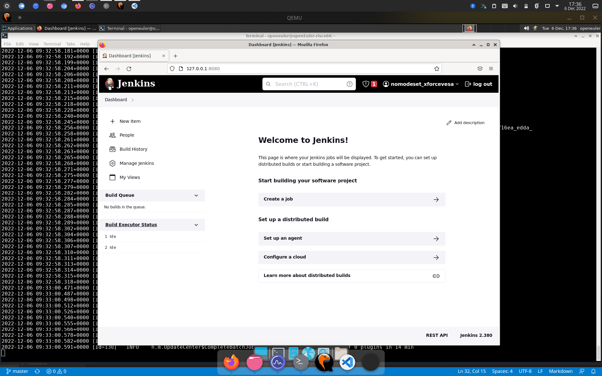
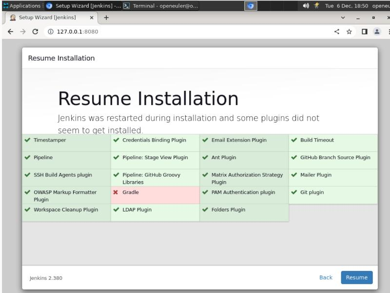
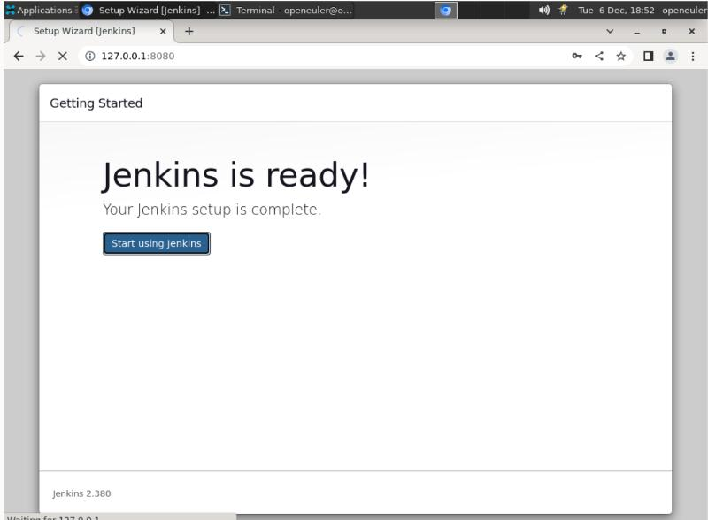
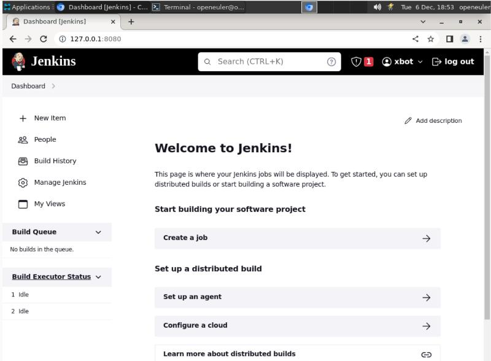
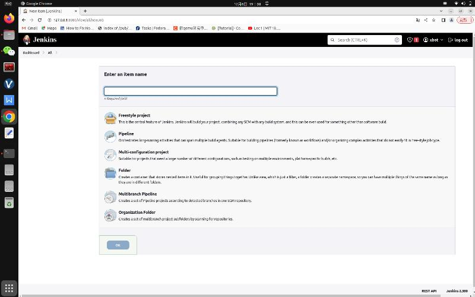
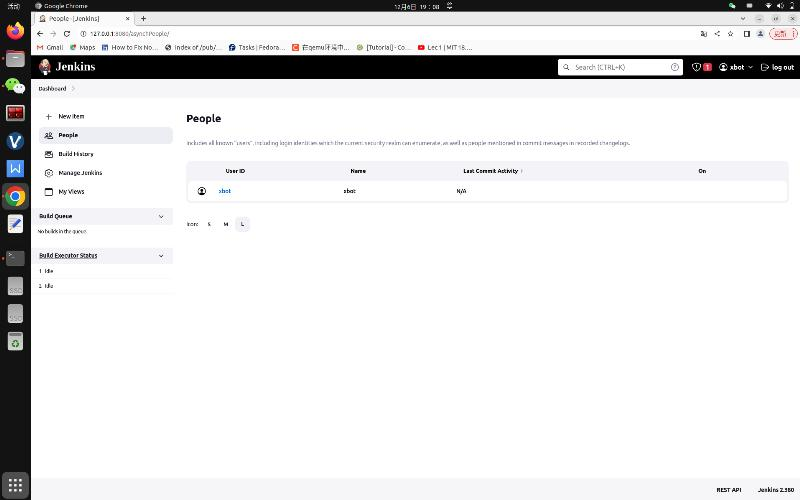
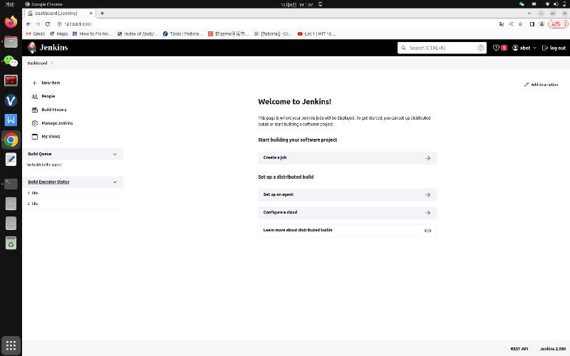

# Jenkins调研报告

# 系统环境

- 运行内存12G，vcpu 20个

- OpenEuler 22.03 V1 RISC-V preview

## 安装教程

### 第1步：导入Jenkins仓库

```bash
sudo wget -O /etc/yum.repos.d/jenkins.repo https://pkg.jenkins.io/redhat/jenkins.repo
sudo rpm --import https://pkg.jenkins.io/redhat/jenkins.io.key
```

### 第2步：使用dnf包管理器安装Jenkins

```bash
sudo dnf install fontconfig java-11-openjdk jenkins -y
sudo alternatives --config java
# 选择java-11-openjdk 即 输入2 回车
```



- 验证一下是否安装成功



## 使用方法

```bash
jenkins --httpPort=8080
```

- 随后浏览器打开 http://127.0.0.1:8080

- 初始化后按照[官方教程](https://www.jenkins.io/zh/doc/)进行操作



## 使用报告

- 初次运行，设置与下载插件花了近一个小时。

- 装好后每次启动Jenkins需要花5分钟。

## 使用截图











